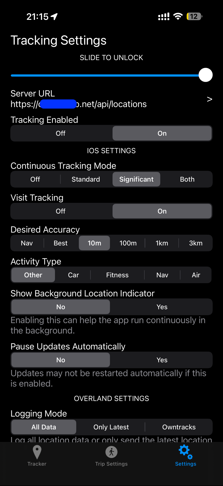

# Whereabouts 📍

> 「あの日、俺はどこにいたか」を自前サーバーで記録・可視化するライフログシステム

iPhoneアプリ [Overland](https://github.com/aaronpk/Overland-iOS) からGPS軌跡を受け取り、リアルタイム地図・日次サマリー・月次集約まで自動生成します。

## スクリーンショット

<!-- スクショここに -->


## 特徴

- **シンプルな構成** — Flask + jsonl + Leaflet。DBは不要
- **データは自分のもの** — Google等の外部サービスに位置情報を送らない
- **自動化** — cronで日次・月次サマリーを自動生成
- **Claude APIで日次キーワード生成** — 訪問地から自動でその日を一言で表現
- **拡張しやすい** — 色モード切替・GPXインポート・複数デバイス対応など1関数で追加可能

## システム構成

```
iPhone / Android (Overland)
    ↓ HTTPS POST
VPS or fly.io (nginx + Flask)
    ↓
locations.jsonl
    ↓
html/map.html              ← リアルタイム地図（60秒更新、時間/速度グラデーション）
daily_summary.py      ← 訪問地検出 + Claude APIキーワード生成
generate_html.py      ← 日次サマリーHTML
generate_monthly.py   ← 月次集約HTML
generate_calendar.py  ← 月次カレンダーHTML
html/status.html           ← サービス稼働状況
gpx_import.py         ← GPXインポーター（重複チェック付き）
generate_search_index.py ← 検索インデックス生成
html/search.html      ← キーワード・日付検索UI
```

## 必要なもの

- iPhone + [Overland](https://apps.apple.com/jp/app/overland-gps-tracker/id1292426766)（無料・OSS）
- VPS または [fly.io](https://fly.io)（無料枠あり）
- Python 3.10+
- nginx（VPSの場合）
- [Anthropic APIキー](https://console.anthropic.com)（日次キーワード生成）

## Quick start: fly.ioへの簡単デプロイ

VPS などサーバ不要。fly.io なら 5 分でインストール完了!

```bash
git clone https://github.com/moneyrebirth/whereabouts
cd whereabouts
# Edit html/map.html and replace API_TOKEN value with your WHEREABOUTS_TOKEN
# html/map.html をエディタで編集し、API_TOKEN をあなたの WHEREABOUTS_TOKEN に修正。
fly auth login
fly apps create your-app-name
fly volumes create whereabouts_data --app your-app-name --region nrt --size 1
fly secrets set WHEREABOUTS_TOKEN=your-secret-token
fly deploy
```

## フルセットアップ (VPS) 

### 1. クローン

```bash
git clone https://github.com/moneyrebirth/whereabouts
cd whereabouts
pip install flask requests anthropic duckdb
```

### 2. 設定

```bash
# APIトークンを設定（locations.pyのAPI_TOKENを変更）
# Anthropic APIキーを設定
echo 'your-anthropic-api-key' > ~/.anthropic_key
chmod 600 ~/.anthropic_key
```

### 3. Flask起動

```bash
python3 locations.py
```

systemdでサービス化（推奨）:

```bash
sudo cp whereabouts.service /etc/systemd/system/
sudo systemctl enable whereabouts
sudo systemctl start whereabouts
```

### 4. nginx設定

```nginx
location /api/locations {
    proxy_pass http://127.0.0.1:5001;
}
location /api/today {
    proxy_pass http://127.0.0.1:5001;
    add_header Cache-Control "no-cache, no-store, must-revalidate";
}
location /api/status {
    proxy_pass http://127.0.0.1:5001;
}
```

### 5. Overlandの設定

- Server URL: `https://yourserver.com/api/locations`
- Access Token: 設定したトークンを入力




### 6. cron設定

```bash
# crontab.exampleを参考に設定
ocrontab -e
```

```
30 0 * * * cd /path/to/whereabouts && python3 daily_summary.py yesterday
31 0 * * * cd /path/to/whereabouts && python3 generate_monthly.py
32 0 * * * cd /path/to/whereabouts && python3 generate_calendar.py
```


## 拡張ポイント

**色モードを追加したい** → `timeToColor()` を書き換えるだけ

**GPXをインポートしたい** → `/api/import` エンドポイントを1つ追加するだけ

**複数デバイスを色分けしたい** → `device_id` フィールドで分岐するだけ

**Android対応** → [Overland Android](https://github.com/OpenHumans/overland_android) も同じAPIで動作

## 応用事例

- 📍 俺ログ (自分のための位置ログ)
- 🚴 ロードバイクなど 速度に応じた色分け表示でルートを可視化
- 🏔️ ハイキングの軌跡記録（GPXインポート対応）
- 👨‍👩‍👧家族間での位置情報共有（マルチデバイス対応）
- 🚗 車両追跡（フリート管理）


## ライセンス

MIT
