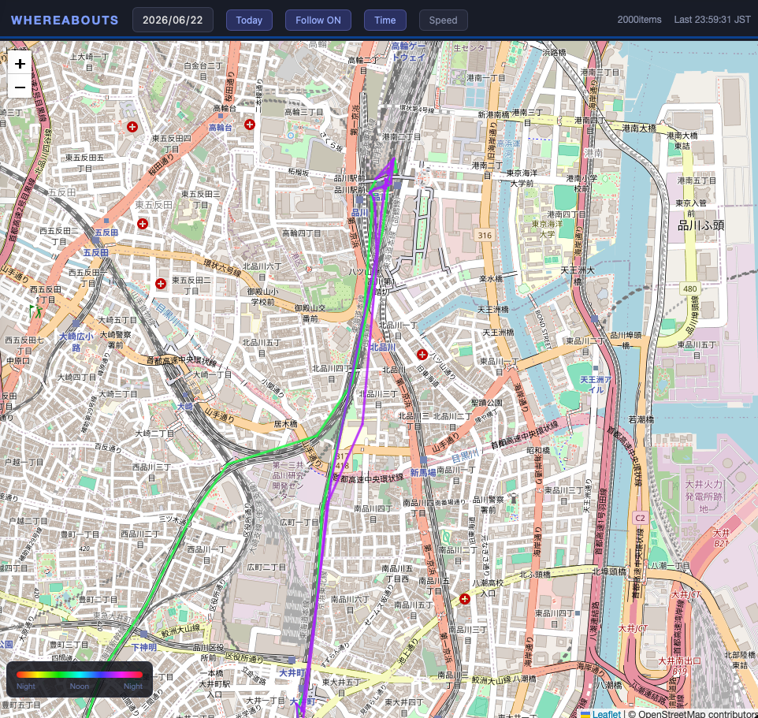

# Whereabouts 📍

> "Where was I that day?" — A self-hosted GPS life-log system that answers this question.

Whereabouts receives GPS tracks from [Overland](https://github.com/aaronpk/Overland-iOS) (iOS/Android) and automatically generates real-time maps, daily summaries, and monthly aggregations on your own server.

## Screenshots

<!-- screenshots here -->


## Features

- **Simple stack** — Flask + JSONL + Leaflet. No database required.
- **Your data, your server** — Location data never leaves your own infrastructure.
- **Fully automated** — cron generates daily and monthly summaries automatically.
- **AI-powered summaries** — Claude API generates daily keywords and comments from visited places.
- **Easily extensible** — Color modes, GPX import, multi-device support — each is just one function away.

## Architecture


```
iPhone (Overland)
    ↓ HTTPS POST
VPS or fly.io (nginx + Flask)
    ↓
locations.jsonl
    ↓
map.html              ← Real-time map (60s refresh, time/speed color gradient)
daily_summary.py      ← Place detection + Claude API keyword generation
generate_html.py      ← Daily summary HTML
generate_monthly.py   ← Monthly aggregation HTML
generate_calendar.py  ← Monthly calendar HTML
status.html           ← Service health dashboard
```

## Requirements

- iPhone or Android + [Overland](https://apps.apple.com/jp/app/overland-gps-tracker/id1292426766) (free, OSS)
- VPS or [fly.io](https://fly.io) (free tier available)
- Python 3.10+
- nginx (for VPS setup)
- [Anthropic API key](https://console.anthropic.com) (for daily keyword generation)

## Quick Start (fly.io)

No VPS needed. Deploy in 5 minutes.

```bash
git clone https://github.com/moneyrebirth/whereabouts
cd whereabouts
# Edit html/map.html and replace API_TOKEN value with your WHEREABOUTS_TOKEN
fly auth login
fly apps create your-app-name
fly volumes create whereabouts_data --app your-app-name --region nrt --size 1
fly secrets set WHEREABOUTS_TOKEN=your-secret-token
fly deploy
```

Set Overland's Server URL to `https://your-whereabouts.fly.dev/api/locations` and you're done.

## Full Setup (VPS)

### 1. Install

```bash
git clone https://github.com/moneyrebirth/whereabouts
cd whereabouts
pip install flask requests anthropic
```

### 2. Configure

```bash
# Set your Anthropic API key
echo 'your-anthropic-api-key' > ~/.anthropic_key
chmod 600 ~/.anthropic_key
```

Set `WHEREABOUTS_TOKEN` in your environment or systemd service file.

### 3. Start Flask

```bash
python3 locations.py
```

Or as a systemd service:

```bash
sudo cp whereabouts.service /etc/systemd/system/
sudo systemctl enable whereabouts
sudo systemctl start whereabouts
```

### 4. nginx config

```nginx
location /api/locations {
    proxy_pass http://127.0.0.1:5001;
}
location /api/today {
    proxy_pass http://127.0.0.1:5001;
    add_header Cache-Control "no-cache, no-store, must-revalidate";
}
location /api/status {
    proxy_pass http://127.0.0.1:5001;
}
```

### 5. Overland settings

- Server URL: `https://yourserver.com/api/locations`
- Access Token: your `WHEREABOUTS_TOKEN` value

### 6. cron

```bash
# See crontab.example
30 0 * * * cd /path/to/whereabouts && YESTERDAY=$(TZ='Asia/Tokyo' date -d yesterday +\%Y-\%m-\%d) && python3 daily_summary.py $YESTERDAY >> cron.log 2>&1 && python3 generate_html.py $YESTERDAY >> cron.log 2>&1
31 0 * * * cd /path/to/whereabouts && python3 generate_monthly.py >> cron.log 2>&1
32 0 * * * cd /path/to/whereabouts && python3 generate_calendar.py >> cron.log 2>&1
```

## Extending Whereabouts

**Add a new color mode** → modify `timeToColor()` in `map.html`

**Import GPX files** → add one `/api/import` endpoint to `locations.py`

**Multi-device color coding** → branch on `device_id` field in the render function

**Android support** → [Overland Android](https://github.com/OpenHumans/overland_android) works with the same API

## Use Cases

- 📍 Personal life-log ("俺ログ")
- 🚴 Cycling route visualization with speed color gradient
- 🏔️ Hiking track logging (with GPX import)
- 👨‍👩‍👧 Family location sharing (multi-device)
- 🚗 Vehicle tracking (fleet management)

## License

MIT

